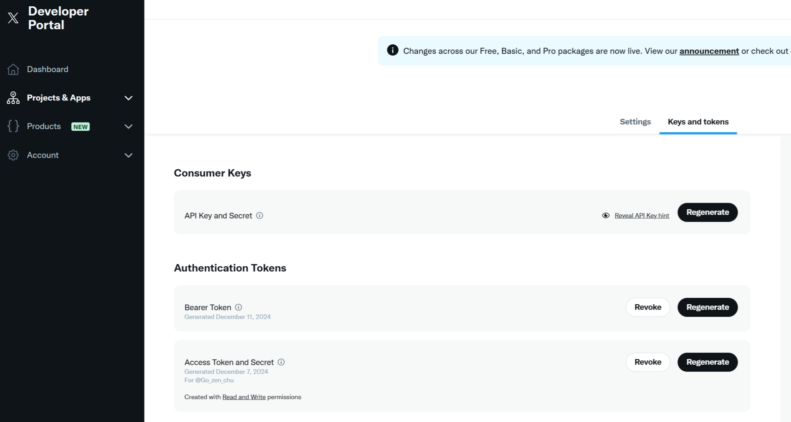
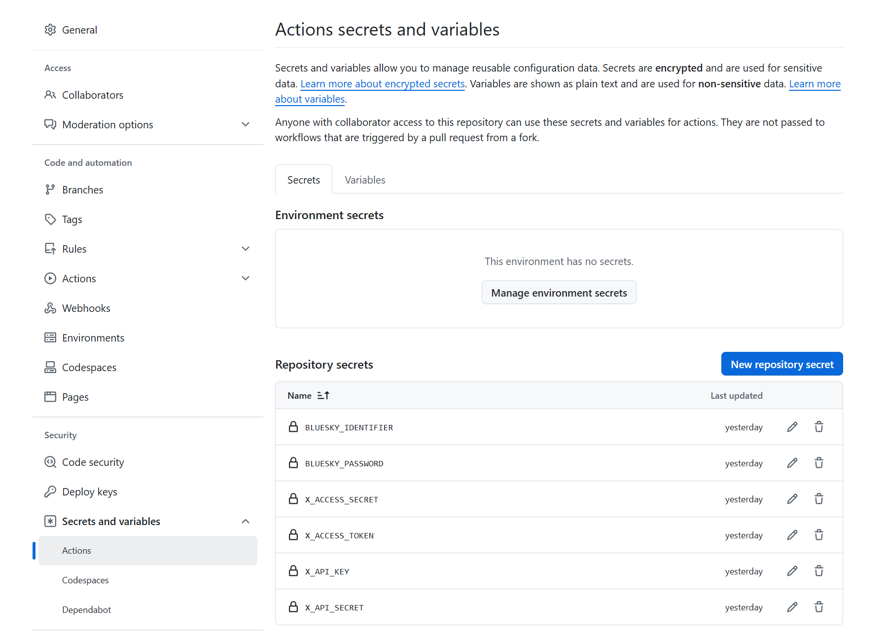

# bluesky2x-workflow

[](https://github.com/go-zen-chu/bluesky2x-workflow/actions)

GitHub Action workflow for syncing bluesky post to X using [switchboard](https://github.com/go-zen-chu/switchboard).

Check [](https://github.com/go-zen-chu/bluesky2x-workflow/issues) for any issues about this workflow.

## ⚠️Limitations

- [Please check Twitter API limitation](https://developer.x.com/en/portal/products/free). If you are Free plan, it will be very easy to surpass number of posts limitation
- There are several features that are not implemented in [switchboard](https://github.com/go-zen-chu/switchboard/labels/enhancement)

## Installation

1. Fork this repository
2. [Create X developer app and generate access token, api keys and so on](https://developer.x.com/en/docs/apps/overview).
    

3. After fork, configure repository secrets below following [GitHub docs](https://docs.github.com/en/actions/security-for-github-actions/security-guides/using-secrets-in-github-actions).

    ```text
    BLUESKY_IDENTIFIER
    BLUESKY_PASSWORD
    X_ACCESS_TOKEN
    X_ACCESS_SECRET
    X_API_KEY
    X_API_SECRET
    ```

    It would be like an image below. 
